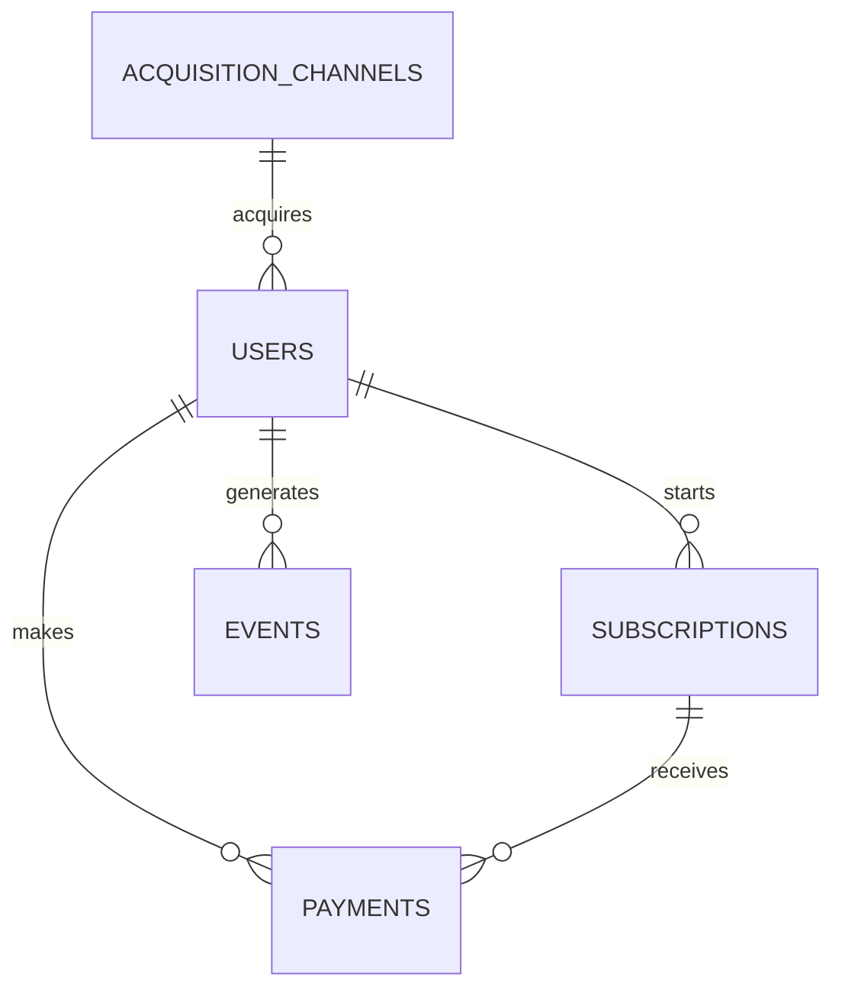

# Fintech Product Metrics SQL Lab

An open, reproducible SQL analytics lab for understanding how fintech-style subscription products grow, monetize, retain users, and handle payment friction.

The repository combines a realistic PostgreSQL data model, deterministic synthetic data, documented metric definitions, 38 core analyses, practical experiment plans, and row-level data-quality diagnostics. It is designed to connect SQL output to business interpretation rather than treating queries as isolated exercises.

All data is synthetic.

## Why this project exists

Product metrics are rarely difficult because of arithmetic alone. The difficult part is deciding:

- which users belong in a denominator;
- what event proves activation or retention;
- whether revenue is gross, net, collected, or recurring;
- how billing cadence affects comparisons;
- how refunds, failures, cancellations, and reactivations change a metric;
- whether an observed difference supports a decision or only another question.

This lab makes those choices visible. Each SQL file starts with a business question and explains what the query calculates. The supporting documentation records assumptions, limitations, and interpretation guidance.

## Who may find it useful

- Analysts and business analysts learning a subscription data model
- Product analysts defining activation, retention, and monetization metrics
- Product managers and founders testing metric questions before building reporting
- Data learners practicing PostgreSQL with connected business scenarios
- Teams discussing consistent definitions for payments and recurring revenue

## Questions the lab answers

The analyses cover questions such as:

- How are daily and monthly signups changing?
- Which channels and countries produce strong activation?
- How long does it take users to start a trial and make a first payment?
- Which billing plans do converted users select?
- What are net revenue, month-end MRR, ARR run rate, and ARPU?
- Which cohorts remain active after their first payment?
- What is monthly gross churn, and why do users cancel?
- Which payment providers have the highest failure rates?
- How many failed payments recover within seven days?
- Are payment failures associated with cancellation?
- Which channels produce the highest observed value per signup?
- Where is there scale but below-average monetization?
- How should trial reminders and failed-payment recovery flows be tested?
- Which data anomalies can invalidate revenue, conversion, or retention metrics?

The complete question set is in [docs/business_questions.md](docs/business_questions.md).

## Data model

The model follows five connected entities:



- `acquisition_channels` describes source, channel type, and paid/organic classification.
- `users` stores signup date, country, device, language, age group, and acquisition source.
- `subscriptions` stores trial dates, plan, lifecycle status, cancellation date, and reason.
- `payments` stores attempts, successful charges, refunds, providers, and failure reasons.
- `events` stores timestamped user, subscription, and payment lifecycle events.

The PostgreSQL schema enforces primary keys, foreign keys, ownership consistency between payments and subscriptions, valid category values, and basic lifecycle chronology. See [docs/data_dictionary.md](docs/data_dictionary.md) for column-level definitions.

## Synthetic dataset

The checked-in dataset contains:

| Entity | Rows | Coverage |
|---|---:|---|
| Users | 5,000 | Signups across 2025 |
| Acquisition channels | 8 | Social, search, referral, marketplace, advertising, and partners |
| Subscriptions | 3,663 | Trial, active, canceled, and expired lifecycles |
| Payments | 5,571 | Successful, failed, recovered, and refunded records |
| Events | 19,297 | Signup, trial, billing, support, plan, cancellation, and reactivation events |

The generator uses seed `42`. Running it again produces the same CSV files and validates key relational rules before writing them.

Signups and payments run through 2025. A small number of lifecycle events for late-December signups extend to 2026-01-20, so event-based and payment-based analyses have slightly different observation endpoints.

## Metrics included

| Area | Metrics and analyses |
|---|---|
| Growth | Daily signups, monthly signups, growth rate, country mix, channel mix |
| Activation | Trial start rate, trial-to-paid conversion, activation by channel/country, time to activation, plan selection |
| Revenue | Gross revenue, refunds, net revenue, month-end MRR, ARR run rate, ARPU, revenue by plan/channel/country |
| Retention | Signup-cohort activity, paid subscription retention, gross churn, cancellation reasons, reactivation |
| Payments | Success rate, failure rate, provider performance, recovery rate, value at risk, failure/churn relationship |
| Value | Observed LTV by channel/country/plan, high-value users, lifecycle segments |
| Decisions | Acquisition scorecards, high-churn channels, 90-day retention, plan performance, growth opportunities |
| Experiments | Trial reminders, failed-payment recovery, group conversion, shared guardrails |
| Data quality | Duplicate payments, orphaned users, refund treatment, lifecycle timing, test-user contamination |

The exact numerator, denominator, grain, and caveat for each metric are documented in [docs/metrics_glossary.md](docs/metrics_glossary.md).

## Quickstart

Requirements: Python 3.10 or newer, `pandas`, `numpy`, PostgreSQL, and the `psql` command-line client.

```bash
python -m venv .venv
source .venv/bin/activate
pip install pandas numpy
python scripts/generate_synthetic_data.py

createdb fintech_metrics
psql -d fintech_metrics -f db/schema.sql
psql -d fintech_metrics -f db/load_data.sql
psql -d fintech_metrics -f db/sample_checks.sql
```

Windows PowerShell activation:

```powershell
.venv\Scripts\Activate.ps1
```

The detailed guide includes setup checks, expected row counts, path troubleshooting, and example query commands: [docs/quickstart.md](docs/quickstart.md).

## Generate and load sample data

Regenerate the CSV files from the repository root:

```bash
python scripts/generate_synthetic_data.py
```

The script prints `Validation passed` before writing the five files. The committed CSVs are ready to use, so regeneration is optional.

Load them into PostgreSQL:

```bash
psql -d fintech_metrics -f db/schema.sql
psql -d fintech_metrics -f db/load_data.sql
```

`db/load_data.sql` uses psql's client-side `\copy`. Run it from the repository root or replace the relative `data/` paths with absolute paths.

## Run analyses

Every analysis is independently runnable after loading the data:

```bash
psql -d fintech_metrics -f sql/02_activation/02_trial_to_paid_conversion.sql
psql -d fintech_metrics -f sql/03_revenue/02_mrr.sql
psql -d fintech_metrics -f sql/04_retention_churn/03_paid_user_retention.sql
psql -d fintech_metrics -f sql/05_payments/04_recovered_payments.sql
psql -d fintech_metrics -f sql/07_product_insights/04_plan_performance_summary.sql
```

The numbered folders form a useful reading path: begin with growth and activation, establish revenue definitions, then move to retention, payment reliability, user value, and cross-functional insights.

## Run data quality checks

```bash
psql -d fintech_metrics -f db/sample_checks.sql
```

The checks cover:

- expected row counts and duplicate identifiers;
- missing foreign keys and payment/subscription owner mismatches;
- invalid lifecycle dates and state combinations;
- missing signup, payment, or cancellation events;
- incorrect use of payment failure reasons;
- gross, refunded, and net revenue reconciliation;
- refunds without a matching earlier successful charge.

Most diagnostic queries should return `0` or no rows. The revenue reconciliation query returns totals for manual comparison.

For row-level anomaly diagnostics, use the dedicated [data-quality section](data-quality/README.md):

```bash
psql -d fintech_metrics -f data-quality/sql/duplicate_payments.sql
psql -d fintech_metrics -f data-quality/sql/active_subscription_without_successful_payment.sql
psql -d fintech_metrics -f data-quality/sql/events_before_registration.sql
```

These queries are non-destructive and return suspicious records for investigation. Most are expected to return zero rows.

## Design and analyze experiments

The [experiments section](experiments/README.md) connects business problems, hypotheses, target populations, assignment, primary metrics, guardrails, SQL analysis, and pre-agreed decision rules.

It includes:

- a reusable [experiment template](experiments/experiment_template.md);
- a [trial-expiration reminder experiment](experiments/trial_to_paid_conversion_experiment.md);
- a [three-step failed-payment recovery experiment](experiments/failed_payment_recovery_experiment.md);
- PostgreSQL examples for [conversion by group](experiments/sql/conversion_by_group.sql) and [guardrail metrics](experiments/sql/guardrail_metrics.sql).

The sample schema has no recorded assignment table, so the lab SQL uses deterministic hashing to create reproducible groups. The documentation identifies the production assignment contract and the data checks required before interpreting a treatment effect.

## How to interpret results

Use the query output as evidence inside a metric definition, not as a conclusion by itself.

1. **Check the grain.** A payment row, subscription row, and user row answer different questions.
2. **Read the denominator.** Signup-to-paid conversion and trial-to-paid conversion are both valid but not interchangeable.
3. **Separate flow from state.** Monthly revenue is a payment flow; MRR is a month-end subscription snapshot.
4. **Control for billing cadence.** Paid retention uses subscription state so yearly plans are not treated as inactive between charges.
5. **Respect observation windows.** Recent cohorts have had less time to retain, cancel, or generate value.
6. **Treat association carefully.** A higher churn rate among users with payment failures does not prove that failure caused cancellation.
7. **Keep synthetic findings in context.** They demonstrate analysis patterns, not external market behavior.

Worked interpretation is available in [docs/analysis_summary.md](docs/analysis_summary.md), with implementation notes in [docs/sql_notes.md](docs/sql_notes.md).

## Repository structure

```text
fintech-product-metrics-sql/
|-- README.md
|-- LICENSE
|-- data/                         # Deterministic synthetic CSV files
|-- db/
|   |-- schema.sql                # PostgreSQL tables, constraints, indexes
|   |-- load_data.sql             # psql \copy commands
|   `-- sample_checks.sql         # Data quality and reconciliation checks
|-- docs/
|   |-- quickstart.md
|   |-- metrics_glossary.md
|   |-- data_dictionary.md
|   |-- business_questions.md
|   |-- analysis_summary.md
|   `-- sql_notes.md
|-- experiments/
|   |-- README.md
|   |-- experiment_template.md
|   |-- trial_to_paid_conversion_experiment.md
|   |-- failed_payment_recovery_experiment.md
|   `-- sql/                       # Group conversion and experiment guardrails
|-- data-quality/
|   |-- README.md
|   |-- data_quality_rules.md
|   |-- data_quality_checklist.md
|   |-- anomaly_examples.md
|   `-- sql/                       # Read-only suspicious-row checks
|-- scripts/
|   `-- generate_synthetic_data.py
`-- sql/
    |-- 01_user_growth/
    |-- 02_activation/
    |-- 03_revenue/
    |-- 04_retention_churn/
    |-- 05_payments/
    |-- 06_ltv_segments/
    `-- 07_product_insights/
```

## Design decisions and limitations

- `amount_usd` is a comparable USD-equivalent amount; `currency` preserves the modeled billing currency.
- Refunds are separate rows. Net revenue equals successful charge value less refunded value.
- MRR uses paid subscriptions active at month end and normalizes their first successful charge by plan term.
- ARR is `MRR * 12`; it is a run rate, not booked or recognized annual revenue.
- Observed LTV is realized net revenue inside the dataset window, not a forecast.
- A subscription row stores the main lifecycle. Events provide plan-change and reactivation timing; a full production model would use subscription-history periods.
- No acquisition cost is modeled, so channel value cannot be interpreted as profitability or payback.

## Roadmap

- Add subscription-history periods for upgrades, downgrades, pauses, and reactivations.
- Add campaign cost to support CAC, payback period, and LTV-to-CAC analysis.
- Model dunning attempt sequence, retry strategy, and recovery cost.
- Add product-usage events for feature-level activation and behavioral retention.
- Add recorded experiment assignment and treatment-delivery data.
- Extend the observation window and provide censoring-aware cohort comparisons.
- Add automated PostgreSQL query execution in continuous integration.

## Documentation index

- [Quickstart](docs/quickstart.md)
- [Metrics glossary](docs/metrics_glossary.md)
- [Data dictionary](docs/data_dictionary.md)
- [Business questions](docs/business_questions.md)
- [Analysis summary](docs/analysis_summary.md)
- [SQL notes](docs/sql_notes.md)
- [Experiments](experiments/README.md)
- [Data quality](data-quality/README.md)

## License and data notice

The code and documentation are available under the MIT License. All people, transactions, events, and outcomes are synthetic and intended for analytical learning and experimentation only.
