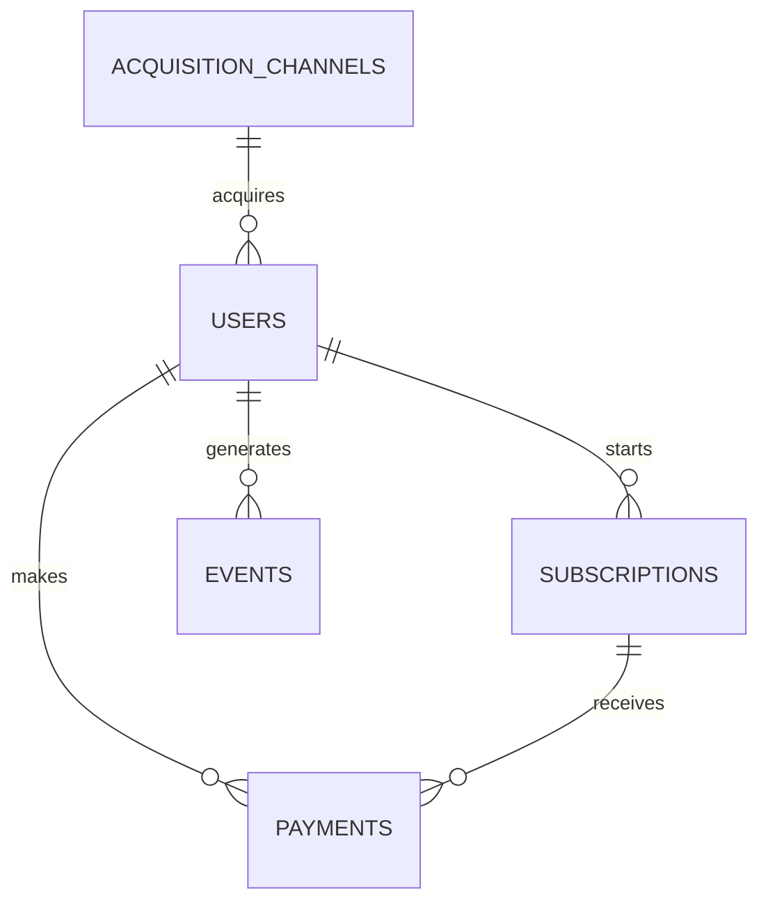

# Fintech Product Metrics with SQL

A PostgreSQL analytics project built around a deterministic synthetic dataset for a neutral fintech subscription app. It connects user acquisition, trials, subscriptions, payments, cancellations, and product events to answer practical questions about growth, monetization, retention, and payment reliability.

## Purpose

This repository is a compact research environment for exploring how product and revenue definitions become SQL. The queries favor transparent assumptions, readable CTEs, and reproducible results over framework complexity.

The analysis asks questions such as:

- Which channels attract users who activate and monetize?
- How do trial start and trial-to-paid conversion vary by market?
- How are MRR, ARR, ARPU, and observed LTV changing?
- Which plans retain customers and generate durable value?
- Where do payment failures occur, and how often are they recovered?
- Are failed payments associated with higher cancellation?
- Which channel-country segments have scale but weak monetization?

## Repository structure

```text
fintech-product-metrics-sql/
├── data/                         # Five generated CSV datasets
├── db/                           # PostgreSQL schema, loading, and checks
├── docs/                         # Definitions, questions, findings, and SQL notes
├── scripts/generate_synthetic_data.py
└── sql/
    ├── 01_user_growth/
    ├── 02_activation/
    ├── 03_revenue/
    ├── 04_retention_churn/
    ├── 05_payments/
    ├── 06_ltv_segments/
    └── 07_product_insights/
```

## Dataset overview

The checked-in data contains 5,000 users who signed up during 2025, 3,663 subscription records, 5,571 payment records, and 19,297 lifecycle events. The generator models:

- eight countries and eight acquisition channels;
- monthly, quarterly, and yearly plans;
- trials, paid conversion, cancellation, expiry, and reactivation;
- successful, failed, recovered, and refunded payments;
- card, crypto, bank transfer, Apple Pay, and Google Pay providers;
- product events such as support contacts and plan changes.

Generation uses a fixed seed (`42`), so rerunning the script produces the same files.

## Entity relationships



`users` is the acquisition anchor. A user may have a subscription, payments tied to that subscription, and many timestamped events. `acquisition_channels` provides channel metadata. Foreign keys in `db/schema.sql` enforce these relationships.

## Metrics covered

- signup growth and acquisition mix;
- trial start, trial-to-paid, and signup-to-paid conversion;
- gross and net revenue, collected MRR, ARR run rate, and ARPU;
- gross churn, activity cohort retention, and paid-user retention;
- payment success, failure, and seven-day recovery;
- observed LTV by channel, country, and plan;
- high-value and lifecycle-based user segments.

Definitions and caveats are documented in [docs/metrics_glossary.md](docs/metrics_glossary.md).

## Run locally

Requirements: Python 3.10+, `pandas`, `numpy`, PostgreSQL, and `psql`.

```bash
python -m venv .venv
source .venv/bin/activate          # Windows PowerShell: .venv\Scripts\Activate.ps1
pip install pandas numpy
python scripts/generate_synthetic_data.py
```

Create a database and load the files from the repository root:

```bash
createdb fintech_metrics
psql -d fintech_metrics -f db/schema.sql
psql -d fintech_metrics -f db/load_data.sql
psql -d fintech_metrics -f db/sample_checks.sql
```

`load_data.sql` uses psql's client-side `\copy` with relative `data/` paths. Replace them with absolute paths if psql is launched from another directory.

Run any analysis file directly, for example:

```bash
psql -d fintech_metrics -f sql/03_revenue/01_monthly_revenue.sql
psql -d fintech_metrics -f sql/05_payments/04_recovered_payments.sql
psql -d fintech_metrics -f sql/07_product_insights/04_plan_performance_summary.sql
```

## Example insights

Results from the generated dataset illustrate the kind of product discussion the queries support:

- 73.26% of users start a trial, and 51.13% of trial users make a successful payment.
- Net collected revenue is $113,683.40 after $1,670.61 of refunds.
- Referral and Organic Search lead observed revenue per signup at $27.18 and $26.75.
- Paid Ads has scale but lower revenue per signup ($17.29), making downstream conversion a useful investigation area.
- Crypto has the highest payment failure rate (10.18%); card is lowest among the modeled providers (6.49%).
- Kazakhstan and Georgia lead multi-month paid retention at approximately 62%.
- Yearly plans generate substantial revenue despite lower adoption, while monthly plans remain the largest revenue contributor.
- 7.87% of users with a cancellation event later reactivate.

These are observations about generated data, not claims about real customers or markets. See [docs/analysis_summary.md](docs/analysis_summary.md) for the full interpretation.

## Design choices

- `amount_usd` stores a comparable USD-equivalent value while `currency` preserves the user's modeled local billing currency.
- Refunds are separate payment rows; net revenue equals successful charges less refunded amounts.
- Collected MRR normalizes successful plan charges by billing term. It is not a contractual billing schedule.
- Observed LTV is realized net revenue in the available window, not a forward-looking prediction.
- Retention definitions differ by question and are stated in each SQL file.

## Future improvements

- Add subscription history rows for every upgrade, downgrade, and reactivation period.
- Model acquisition spend to calculate CAC, payback period, and LTV:CAC.
- Add dunning attempt numbers and richer payment recovery sequences.
- Introduce experiment assignments for activation and pricing analysis.
- Extend the observation window to reduce censoring in later cohorts.

## Documentation

- [Metrics glossary](docs/metrics_glossary.md)
- [Data dictionary](docs/data_dictionary.md)
- [Business questions](docs/business_questions.md)
- [Analysis summary](docs/analysis_summary.md)
- [SQL notes](docs/sql_notes.md)

## Disclaimer

All people, transactions, events, and outcomes in this repository are synthetic. The dataset is intended only for learning and analytical experimentation and must not be treated as real financial or customer data.

## License

MIT
