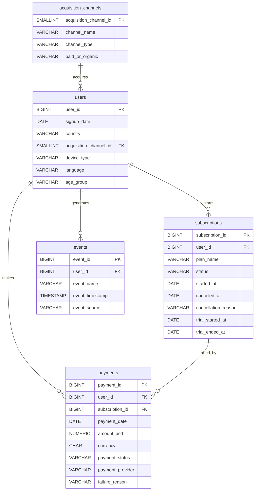

# Entity Relationship Diagram

This project uses a compact relational model for analyzing a synthetic fintech subscription product. The schema connects acquisition, user registration, subscription lifecycle, payment attempts, and product events.

The ERD below is written in Mermaid syntax and should render directly on GitHub.

## Relationship Explanation

### Acquisition channels to users

One acquisition channel can have many users. Each user belongs to one acquisition channel through `users.acquisition_channel_id`.

This relationship supports questions such as:

- Which channels bring the most users?
- Which channels bring users who convert to paid subscriptions?
- Which channels produce higher revenue or better retention?

### Users to subscriptions

One user can have many subscriptions. Each subscription belongs to one user through `subscriptions.user_id`.

This relationship supports analysis of trial starts, paid conversion, plan selection, cancellations, expirations, and reactivation behavior.

### Users to payments

One user can have many payments. Each payment belongs to one user through `payments.user_id`.

This relationship supports user-level revenue analysis, payment success rates, failed payment behavior, refunds, and lifetime revenue.

### Subscriptions to payments

One subscription can have many payments. Each payment belongs to one subscription through `payments.subscription_id`.

This relationship connects billing activity to subscription lifecycle status. It is used for MRR, ARR, revenue by plan, payment recovery, and churn-related billing analysis.

### Users to events

One user can have many events. Each event belongs to one user through `events.user_id`.

Events describe lifecycle and product behavior such as signup, trial start, subscription start, payment success, payment failure, cancellation, support contact, plan changes, and reactivation.

## Analytical Use

The model is intentionally simple enough to inspect by hand, but complete enough to answer practical product analytics questions:

- acquisition quality by channel
- signup, trial, and paid conversion
- revenue by plan, country, and channel
- retention and churn by cohort
- payment success and failed payment recovery
- user segmentation by lifetime value and churn risk

The schema is designed for PostgreSQL and can be loaded from the CSV files in the `data/` folder.
